# 24-Hour Implementation Roadmap: DYAD
## Sprint Plan, Codebase Architecture & Execution Guide

---

## 1. 24-Hour Hackathon Timeline (Hour-by-Hour)

```mermaid
gantt
    title 24-Hour Sprint Schedule
    dateFormat X
    axisFormat T+%Hh

    section Phase 1: Foundation
    Next.js Setup & MapLibre Canvas        :0, 3
    Bangalore Metro GeoJSON & Styling     :2, 4

    section Phase 2: Spatial Engine
    Turf.js Corridor Buffer & Slicing     :4, 7
    Station-Snap & Click-to-Pin UX         :6, 9

    section Phase 3: Agent Network
    Modal Cloud Setup & OpenAI SDK        :7, 10
    Multi-Agent Prompts & Route Handlers  :8, 12
    Fail-safe Deterministic Fallbacks     :11, 13

    section Phase 4: Bi-directional UI
    Authority Dossier & Glassmorphic Panel :12, 16
    Cinematic flyTo 3D Camera Controls    :15, 18
    Ward Hover Tooltips & POI Highlight   :17, 19

    section Phase 5: Ingestion & Polish
    Dataset Segregator Drawer (CSV/GeoJSON):18, 21
    Visual Polish, Ticker & Neon Effects  :20, 22

    section Phase 6: Pitch Prep
    Dry Runs, Screen Recording & Slide Deck:22, 24
```



| Time Window | Milestone | Key Deliverables |
| :--- | :--- | :--- |
| **Hours 0 – 3** | **Project Scaffolding & Map Canvas** | Initialize Next.js (App Router, Tailwind, Lucide, MapLibre GL JS). Render dark vector basemap centered on Bengaluru (`[77.5946, 12.9716]`, zoom 11.5). |
| **Hours 3 – 6** | **Spatial Data & Station-Snap Engine** | Load Namma Metro lines (Purple, Green, Yellow, Blue). Implement click-to-snap for origin stations and free-pin drop for proposed terminus. Render animated corridor line + Turf.js 2km buffer polygon. |
| **Hours 6 – 10** | **Spatial Compute & Curated Layers** | Wire Turf.js spatial intersection algorithms. Filter POIs (tech parks, hospitals, colleges) and BBMP ward polygons within the buffer. Compute geodesic length, TomTom speed delta, and population tally. |
| **Hours 10 – 14** | **Multi-Agent Orchestrator & Modal Cloud API** | Build `/api/analyze-corridor` route and Modal AI cloud app (`modal_app/app.py`). Wire Demographics Agent, POI Agent, Mobility Agent, Ecological Risk Agent with OpenAI API key (GPT-4o). Add Tier-3 cached fail-safe so it never errors on stage. |
| **Hours 14 – 18** | **Authority Intelligence Dossier UI** | Build the right-side collapsible briefing panel. Implement the 4 Quantified Pillar cards (Equity, Time Saved, Climate, Friction), Overall Feasibility Score, and interactive "Fly to Coordinate" buttons. |
| **Hours 18 – 20** | **Dataset Ingestion Drawer** | Add slide-out drawer where users can drag-and-drop custom CSV/GeoJSON files. Implement the Segregator Agent to detect columns, classify domain tags, and add them to the map layers. |
| **Hours 20 – 22** | **Visual Polish & "On Steroids" Flair** | Add live header telemetry ticker (`13.9 km/h speed`, `₹20,000 Cr loss`), animated radar scanning pulse while agents compute, neon glow lines, and 1-click Preset Scenario buttons. |
| **Hours 22 – 24** | **Dry Runs, Pitch Deck & Video Backup** | Rehearse the 3-minute pitch against the script in `HACKATHON_PITCH.md`. Record a 60-second screen recording backup video in case of presentation projector failure. Final slide deck export. |

---

## 2. Project Directory Structure

```text
DYAD/
├── .agents/
│   └── context.md                     # Universal context & agent prototyping rules
├── PRD.md                             # Product Requirements Document
├── ARCHITECTURE.md                    # System Architecture & Agent Contracts
├── HACKATHON_PITCH.md                 # 3-Minute Winning Pitch Script & Q&A
├── IMPLEMENTATION_ROADMAP.md          # This file
├── package.json
├── tsconfig.json
├── tailwind.config.ts
├── modal_app/
│   ├── app.py                         # Modal serverless app with OpenAI integration
│   ├── experiments/                   # Cloud dataset experiment runners
│   │   ├── corridor_sensitivity.py    # Multi-corridor alignment permutations
│   │   └── catchment_simulation.py    # High-volume demographic calculations
│   └── requirements.txt               # geopandas, shapely, openai, modal
├── public/
│   ├── data/
│   │   ├── bangalore_metro.geojson        # Operational & planned Namma Metro lines
│   │   ├── bangalore_stations.json        # 76+ station nodes with line & coordinates
│   │   ├── bbmp_wards.geojson             # BBMP ward boundaries + demographics
│   │   ├── bangalore_pois.geojson         # Tech parks, hospitals, universities
│   │   └── bangalore_water_bodies.geojson # Lakes & environmental buffer zones
│   └── mock/
│       └── cached_dossiers.json           # Fail-safe pre-computed responses
├── src/
│   ├── app/
│   │   ├── layout.tsx
│   │   ├── page.tsx                       # Main Command Center UI
│   │   └── api/
│   │       ├── analyze-corridor/route.ts  # Multi-Agent Orchestrator Endpoint
│   │       └── segregate-data/route.ts    # Dataset Ingestion & Classifier Endpoint
│   ├── components/
│   │   ├── map/
│   │   │   ├── MapCanvas.tsx              # MapLibre GL wrapper & WebGL renderer
│   │   │   ├── CorridorLayer.tsx          # Dynamic corridor line & buffer polygon
│   │   │   ├── StationsLayer.tsx          # Metro station markers with snap logic
│   │   │   └── POILayer.tsx               # Categorized POI markers with glowing colors
│   │   ├── panel/
│   │   │   ├── AuthorityDossier.tsx       # Glassmorphic right-side intelligence brief
│   │   │   ├── PillarMetricCard.tsx       # Individual cards for Equity, Time, Climate, Friction
│   │   │   └── AgentRadarStatus.tsx       # Live status indicators for the 4 agents
│   │   ├── header/
│   │   │   ├── MacroTicker.tsx            # Bengaluru congestion & telemetry ticker
│   │   │   └── PresetScenarios.tsx        # 1-click scenarios (Sarjapur, Hoskote, etc.)
│   │   └── drawer/
│   │       └── DatasetIngestionDrawer.tsx # File drag-and-drop & Segregator Agent UI
│   ├── lib/
│   │   ├── spatial/
│   │   │   ├── buffer.ts                  # Turf.js 2km buffer computation
│   │   │   ├── intersection.ts            # POI & Ward polygon intersection algorithms
│   │   │   └── mobility-math.ts           # TomTom road speed vs Metro delta model
│   │   ├── agents/
│   │   │   ├── orchestrator.ts            # Parallel agent dispatcher
│   │   │   ├── prompts.ts                 # Domain agent prompt templates
│   │   │   ├── segregator.ts              # File schema classifier
│   │   │   ├── llm-client.ts              # OpenAI API client wrapper
│   │   │   └── modal-client.ts            # Modal cloud webhook / API runner
│   │   └── data-helpers.ts                # GeoJSON loader & spatial indexers
│   └── types/
│       ├── metro.ts                       # Metro, Corridor, and POI interfaces
│       ├── dossier.ts                     # AuthorityDossier and Pillar schemas
│       └── ingestion.ts                   # Dataset upload and segregator types
```

---

## 3. High-Priority Curated Preset Scenarios

For the hackathon demo, four pre-configured corridors will be baked into the UI so judges or team members can test real-world scenarios with a single click:

| Preset Name | Origin Station | Proposed Terminus | Length | Primary Story / Angle |
| :--- | :--- | :--- | :--- | :--- |
| **1. The Sarjapur Tech Spine** *(Flagship Demo)* | **Silk Board** (Yellow/Blue Line Interchange) | **Sarjapur Town** via Agara & Bellandur Gate | 14.2 km | **Maximum Economic ROI & Commuter Relief:** Connects Bengaluru's most congested bottleneck (Silk Board) to outer tech campuses (Wipro HQ, RGA Tech Park); saves 1.8M hours/year. |
| **2. The Eastern Industrial Link** | **Whitefield (Kadugodi)** (Purple Line) | **Hoskote Industrial Area** | 12.8 km | **Transit Equity & Manufacturing Belt:** Connects outer industrial and logistics workers to the tech corridor; heavy modal shift from diesel buses. |
| **3. The Electronic City Connector** | **Jayadeva Hospital** (Green/Pink Line Interchange) | **Electronic City Phase 1** via Bannerghatta | 16.5 km | **Cross-Suburban Healthcare & Tech Transit:** Direct route bypassing Silk Board gridlock, high university & hospital density. |
| **4. North-West Commuter Extension** | **Peenya Industry** (Green Line) | **Nelamangala Bus Terminal** | 11.4 km | **Inter-City Truck/Commuter Relief:** Relieves Tumkur Road highway traffic, massive working-class factory commuter catchment. |

---

## 4. Pitfalls & Hackathon Safety Rules

1. **Rule #1: Never Let an External API Block the Demo:**
   Always wrap external LLM API calls with a 3.5-second timeout. If the LLM response doesn't return in time, automatically return the pre-synthesized verified dossier from `cached_dossiers.json` without failing. The judges will experience a lightning-fast, smooth experience.
2. **Rule #2: Keep Client-Side Heavy Math Minimal:**
   Turf.js is ultra-fast for hundreds of points. Avoid loading 100,000 raw building footprints on the client canvas; keep the preloaded dataset curated to key POIs (300 points) and BBMP wards (198 polygons).
3. **Rule #3: The UI Sells the Vision:**
   Judges evaluate visual polish and emotional resonance. The dark MapLibre theme, neon gradient lines, live agent telemetry badges (`[✓ Demographics Analyzed]`), and the smooth 3D `flyTo` camera sweep are what make this feel like *"Google Maps on Steroids"*.
